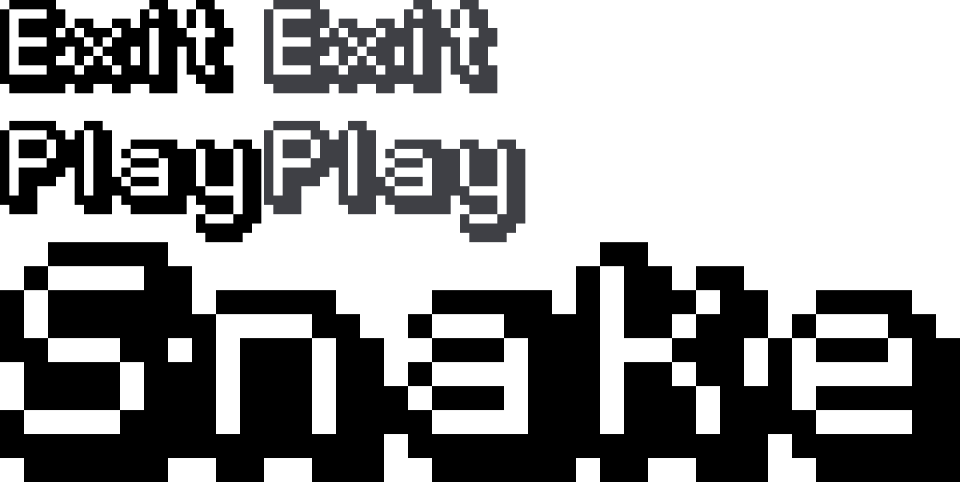

# Sneck

A classic grid-based **Snake** game, written from scratch in Java 21 with **zero runtime
dependencies** — no game engine, no third-party libraries, no asset downloads. Just Swing/AWT2D
for rendering and the JDK's own sound synthesizer for audio.



- **Nothing to install.** One JDK 21 and the bundled Gradle wrapper.
- **Runs anywhere with a display.** Pure `java.awt` — Windows, macOS, Linux, all supported.
- **Mute-safe.** Machines with no sound card silently fall back to silence instead of crashing.
- **Tested.** 99 JUnit tests run headless, with no display and no audio hardware.

---

## Contents

- [Requirements](#requirements)
- [Play in 30 seconds](#play-in-30-seconds)
- [Controls](#controls)
- [How it plays](#how-it-plays)
- [Difficulty](#difficulty)
- [Where your data is stored](#where-your-data-is-stored)
- [Building and running](#building-and-running)
- [Running without Gradle](#running-without-gradle)
- [Project layout](#project-layout)
- [How it's built](#how-its-built)
- [Testing](#testing)
- [Known limitations](#known-limitations)
- [License](#license)

---

## Requirements

| | |
|---|---|
| **Java** | JDK 21 (the project is built and tested on 21) |
| **Build tool** | Gradle 8.11-rc-1, provided by the wrapper — no local install needed |
| **Display** | **Required.** This is a desktop game; it cannot run headless |
| **Runtime deps** | None. JUnit 5 is needed only to run the tests |

On a headless machine (a plain SSH session, most CI containers) the game will fail to open its
window and exit. Use a real desktop session, or `Xvfb` on Linux:

```bash
Xvfb :99 -screen 0 1024x768x24 &
DISPLAY=:99 ./gradlew run
```

The first `./gradlew` invocation downloads the Gradle distribution (~100 MB). All subsequent runs
are offline.

## Play in 30 seconds

```bash
git clone https://github.com/ahaimar/Sneck.git
cd Sneck
./gradlew run
```

That builds the project and launches the game window. Press <kbd>Enter</kbd> to start, steer with
the arrow keys or WASD, and press <kbd>P</kbd> to pause.

On Windows use `gradlew.bat run` instead of `./gradlew run`.

## Controls

### In game

| Key | Action |
|---|---|
| <kbd>↑</kbd> <kbd>↓</kbd> <kbd>←</kbd> <kbd>→</kbd> or <kbd>W</kbd> <kbd>A</kbd> <kbd>S</kbd> <kbd>D</kbd> | Steer. On the ready screen, the first direction press also starts the run |
| <kbd>Enter</kbd> / <kbd>Space</kbd> | Start · pause · resume · retry |
| <kbd>P</kbd> | Pause / resume |
| <kbd>R</kbd> | Retry (only after the run has ended) |
| <kbd>Esc</kbd> | Back to the main menu |
| <kbd>M</kbd> | Mute / unmute sound |

### Main menu

| Input | Action |
|---|---|
| <kbd>Enter</kbd> / <kbd>Space</kbd> | Play |
| <kbd>Esc</kbd> / <kbd>Q</kbd> | Quit |
| <kbd>→</kbd> <kbd>↓</kbd> <kbd>D</kbd> <kbd>S</kbd> | Easier difficulty (wraps) |
| <kbd>←</kbd> <kbd>↑</kbd> <kbd>A</kbd> <kbd>W</kbd> | Harder difficulty (wraps) |
| <kbd>M</kbd> | Mute / unmute sound |
| Mouse | Hover for highlight; click **PLAY**, **QUIT**, or the difficulty pill |

The mouse is only used in the menu. Difficulty is chosen in the menu and applies to the *next* run.

> **Input is edge-triggered.** Holding a direction key does not repeat-turn the snake — OS
> auto-repeat is deliberately filtered out. You get exactly one turn per physical press, and up to
> two turns are buffered, so a fast "right then up" is honoured on consecutive cells.

## How it plays

- Eat the food to grow and score **10 points** per piece.
- **The walls are fatal** — there is no wrapping. Hitting any edge ends the run.
- **Running into yourself is fatal**, with one mercy: on a step where you don't grow, you are
  allowed to move into the cell your tail is vacating, because the tail leaves in the same move.
  A snake that is currently growing may *not* follow its own tail.
- You never die on the start line. A run begins in a **ready** state and does not move a single
  cell until you press something, so pick your first direction deliberately.
- You can only **win** by filling every one of the 500 cells on the board, which requires a
  near-perfect run. There are no lives and no mercy period.
- The window title tracks your score live: `Snake - score 120`.

## Difficulty

Every difficulty has its own speed ramp: the snake starts at one speed and gets faster with each
piece of food, bottoming out at a floor. Higher difficulties start faster, ramp harder, and start
you out longer.

| Difficulty | Start speed | Top speed | Speeds up by | Starts at | Max score |
|---|---|---|---|---|---|
| **Easy** | 200 ms/cell | 100 ms/cell | −2 ms per food | 4 segments | 4960 |
| **Normal** *(default)* | 140 ms/cell | 55 ms/cell | −4 ms per food | 4 segments | 4960 |
| **Hard** | 100 ms/cell | 40 ms/cell | −6 ms per food | 5 segments | 4950 |
| **Insane** | 75 ms/cell | 30 ms/cell | −8 ms per food | 6 segments | 4940 |

Max scores differ because the starting snake occupies cells that can never hold food. Normal is
the default; your choice is remembered between sessions.

## Where your data is stored

Two small text files in your home directory, in a `.snake` folder. Both are created on demand.

| File | Contents |
|---|---|
| `~/.snake/highscore` | Your best score, a single plain number |
| `~/.snake/settings` | `difficulty` and `muted` as Java `Properties` |

```bash
# Clear your best score
rm ~/.snake/highscore
```

Nothing else is written anywhere, and nothing is ever sent over a network — the game is fully
offline. Every read and write failure is non-fatal: a missing, empty, corrupt, or read-only file
silently falls back to defaults rather than preventing the game from starting.

## Building and running

All commands are run from the project root.

| Command | What it does |
|---|---|
| `./gradlew run` | Build and launch the game |
| `./gradlew test` | Run the test suite (99 tests, no display needed) |
| `./gradlew build` | Compile, test, and produce `build/libs/Sneck-1.0-SNAPSHOT.jar` |
| `./gradlew installDist` | Produce a start-script distribution in `build/distributions/` |
| `./gradlew clean` | Delete all build output |

Run from the project root so the `assets/` folder resolves — the menu tries the classpath first,
then the relative path, and finally degrades to a plain-text menu.

## Running without Gradle

Once you have a jar from `./gradlew build`:

```bash
java -Djava.awt.headless=false -jar build/libs/Sneck-1.0-SNAPSHOT.jar
```

or, without the executable manifest:

```bash
java -Djava.awt.headless=false -cp build/libs/Sneck-1.0-SNAPSHOT.jar org.pack.Main
```

`-Djava.awt.headless=false` is required — without it the JVM may start with no window at all.

## Project layout

```
build.gradle              Gradle build; no runtime dependencies
settings.gradle           Project name: Sneck
gradle/wrapper/           Pinned Gradle 8.11-rc-1
assets/
  menuSprite.png          Sprite sheet: title logo + PLAY/QUIT buttons (normal + hover)
src/main/java/org/pack/
  Main.java               Entry point
  Window.java             Swing frame, fixed-timestep game loop, offscreen renderer
  Scene.java              Abstract screen: onEnter / onExit / update / draw
  GameHost.java           Interface a scene talks to instead of the window
  MenuScene.java          Main menu, difficulty picker, sprite loading
  GameScene.java          The board: input, scoring, pacing, drawing
  SnaKe.java              Rules engine — one cell per step, knows nothing about time or graphics
  Food.java               Spawning and eating
  Cell.java               Immutable grid coordinate record
  Direction.java          Grid direction unit vectors
  Difficulty.java         Speed ramps and start lengths
  GameState.java          MENU / GAME
  Constants.java          Board geometry, colours, timing
  Rect.java               Hit-testing rectangle
  Settings.java           Persisted preferences
  HighScore.java          Persisted best score
  Sound.java              Synthesised PCM effects via javax.sound.sampled
  KL.java / ML.java       Edge-triggered keyboard and mouse listeners
  Time.java               Frame timing
src/test/java/org/pack/   13 JUnit 5 test classes
```

## How it's built

A few decisions worth knowing about, if you want to read the code:

- **Scenes depend on an interface, not on the window.** `Scene` is four methods; screens talk to a
  5-method `GameHost` rather than to `Window` directly. That indirection is what makes the entire
  game drivable and renderable in a headless test.
- **The simulation is a fixed 60 Hz timestep.** Logic advances in constant 1/60 s slices, so the
  game plays identically on a 60 Hz and a 240 Hz display. A single frame longer than 0.25 s is
  discarded rather than fast-forwarded, so dragging the window can't teleport the snake into a wall.
- **Rendering is decoupled from Swing.** Each frame is drawn into an offscreen `BufferedImage` on
  the game thread and blitted by the EDT. Swing repaints can never stall the game loop.
- **The rules engine is pure.** `SnaKe.step()` advances exactly one cell and has no concept of a
  clock, a window, or a `Graphics`. All pacing lives in `GameScene`, which makes the rules trivial
  to test.
- **Grid maths is integer.** `Cell` is an immutable `record`, so collision and bounds checks are
  exact rather than float-approximate.
- **Food placement enumerates the free cells** instead of rejection-sampling, so it's uniformly
  random, never retries, and can't hang as the board fills. A full board returns cleanly — and
  that case *is* the win condition.
- **Audio is synthesised, not sampled.** Five frequency sweeps are written straight into 8-bit PCM
  with a half-sine envelope, so there are no audio files and no clicks at the start or end of a
  note. Effects are queued on a background thread so the game never blocks on the sound card, and
  the queue keeps only the newest effect so bursts of events never lag behind the action.
- **Corrupt saves can never block startup.** Both `Settings` and `HighScore` treat every
  filesystem error as a reason to fall back to defaults.

## Testing

```bash
./gradlew test
```

99 tests across 13 classes, all headless — no display and no audio hardware required. The suite
runs the real scenes through a fake host, drives a real snake along pathfinder-computed routes,
and asserts on rendered **pixels** (head distinct from body, overlays covering the board, menus
actually drawing). It also covers the unhappy paths: corrupt save files, unwritable directories,
missing audio hardware, and out-of-range key codes.

Not covered: `Window`, `Time`, the mouse listener, and the sprite-loading path in `MenuScene`.

## Known limitations

Worth knowing before you file anything as a bug:

- **The mute setting isn't saved.** <kbd>M</kbd> works for the session, but the game always starts
  unmuted. `Settings.setMuted` is currently only reached from tests.
- **Quitting to the menu mid-run discards your score.** The score is banked when the run *ends*,
  so <kbd>Esc</kbd> mid-run throws that run's points away.
- **The sprite sheet isn't packaged into the jar.** It lives in `assets/` and is found by running
  from the project root. `installDist` output falls back to the plain-text menu rather than failing.
- **Only one high score is kept**, not a top-5 leaderboard, and there's no in-game way to clear it
  — delete `~/.snake/highscore` by hand.
- **The game doesn't pause when it loses focus.** Alt-tab away mid-run and it keeps simulating.
- **The Gradle wrapper pins a release candidate** (`8.11-rc-1`) rather than a final release.
- **No HiDPI scaling, fullscreen, gamepad support, or key rebinding.**
- **Naming:** the game presents itself as "Snake" in the UI; the project and artifact are called
  "Sneck".

## License

**No license has been published for this project.** Without one, the default is that all rights
are reserved and nobody may legally reuse, modify, or redistribute it. If you want to use or
contribute to this code, please open an issue first and a license will be added.

## Credits

Built by [ahaimar](https://github.com/ahaimar).
